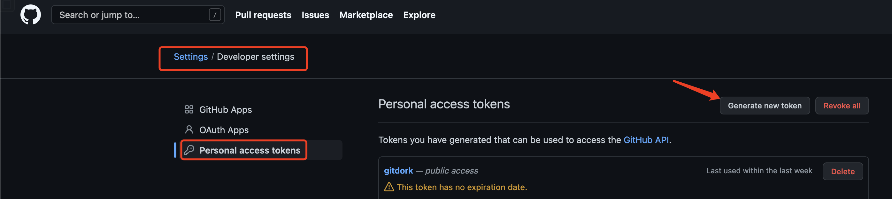

## 介绍

`gitdorks_go`是一款基于GO的自动调用github api收集敏感信息的工具，参考自 [GitDorker](https://github.com/obheda12/GitDorker)，做了部分优化。

## 使用

```ascii
   gitdorks_go

 ____    __  __  __  __  ____  ___
(  _ \  /. |(  \/  )/  )(_  _)/ __)
 )(_) )(_  _))    (  )(   )(  \__ \
(____/   (_)(_/\/\_)(__) (__) (___/

                       v 0.1
Usage of gitdorks_go:
  -ew int
    	how many seconds does each request should wait ? 
    	# 每2个请求间隔多少秒
  -gd string
    	github dorks file path 
    	# github dorks 文件路径
  -gk string
    	github search keyword
    	# github 搜索keyword
  -nw
    	if get github api rate limited, need wait ? (default true) 
    	# 如果遇到了github速率限制，是否等待
  -nws int
    	how many seconds does it wait each time (default 10)
    	# 如果要等待，需要等待多少秒
  -target string
    	target which search in github
    	# 搜索的目标
  -tf string
    	github personal access token file
    	# github personal access token文件，一行一个
  -token string
    	github personal access token

```


```shell
gitdorks_go -gd Dorks/smalldorks.txt -nws 20 -target gm7.org -tf tokenFile/tf.txt -ew 3
```


## 安装

### 自己编译

```shell
go get github.com/damit5/gitdorks_go
```

或者

```shell
git clone https://github.com/damit5/gitdorks_go.git
cd gitdorks_go
bash build.sh
```

### 现成使用

```shell
git clone https://github.com/damit5/gitdorks_go.git
cd gitdorks_go/release
./gitdorks_go_amd_linux
```


### 文件目录

```
.
├── Dorks						# 一些推荐dorks
│   ├── alldorksv3
│   ├── medium_dorks.txt
│   └── smalldorks.txt
├── README.md
├── build.sh					# 编译脚本，可以直接用release目录下的
├── go.mod
├── go.sum
├── main.go						# 主程序
├── release
│   ├── gitdorks_go.exe			# windows
│   ├── gitdorks_go_amd_linux	# linux
│   └── gitdorks_go_darwin		# mac
└── tokenFile
    └── tf.txt					# token file
```

## 参考

* [twitter](https://twitter.com/obheda12/status/1352686678318731264)


* [GitDorker](https://github.com/obheda12/GitDorker)

## Q&A

### Access token 在哪

github设置界面



### 为什么要重复造轮子

GitDorker本来已经很好用了，但是GitHub现在除了一分钟30次请求的限制，还存在[次要速率限制](https://docs.github.com/en/free-pro-team@latest/rest/overview/resources-in-the-rest-api#secondary-rate-limits)，所以使用之前的工具大部分请求都被拦截，拦截了后也不会重新发起请求来获取，相当于过滤掉了这一个关键词，所以用go重写了一个，大概解决了这些问题。

